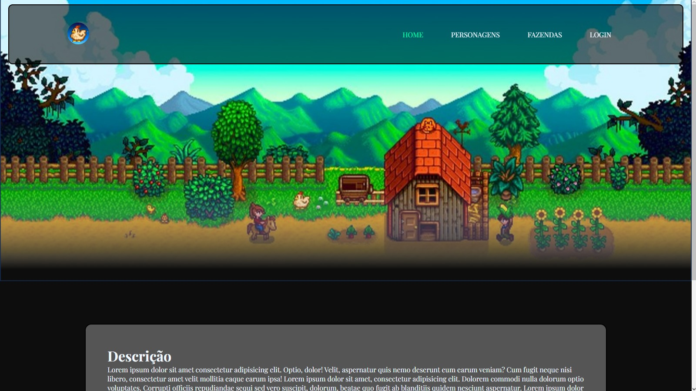
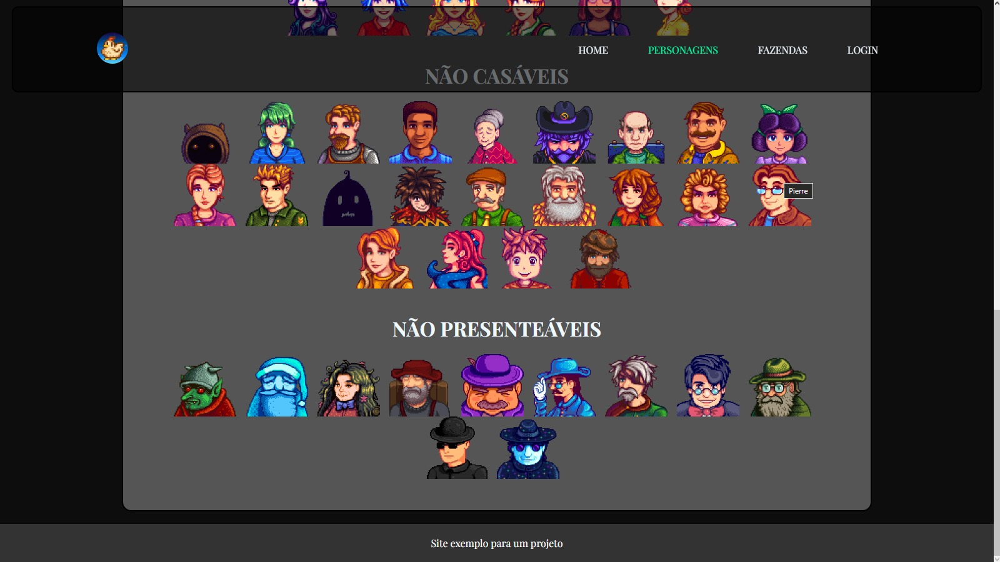
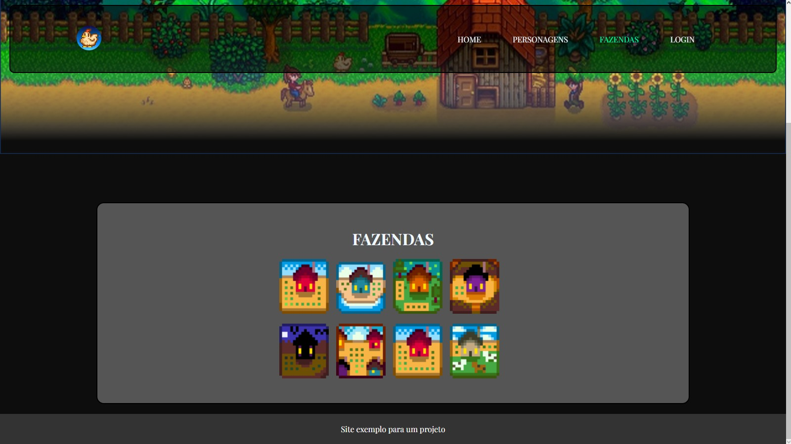
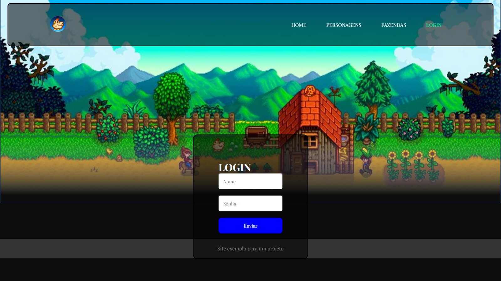

# Meu Curriculo

Um pequeno site informacional para exemplo do PI

## 🚀 Acessando o site

<h4>Você pode acessar o site pelo link</h4> https://curriculo-aleixo-52c42a.netlify.app

## Descrição

Um site breve sobre stardewValley, para introduzir o meu PI.

## Imagens do site

    

 

    

 

    

 

    

 

## 🛠️ Construído com

Visual Studio Code utilizando HTML e CSS.

